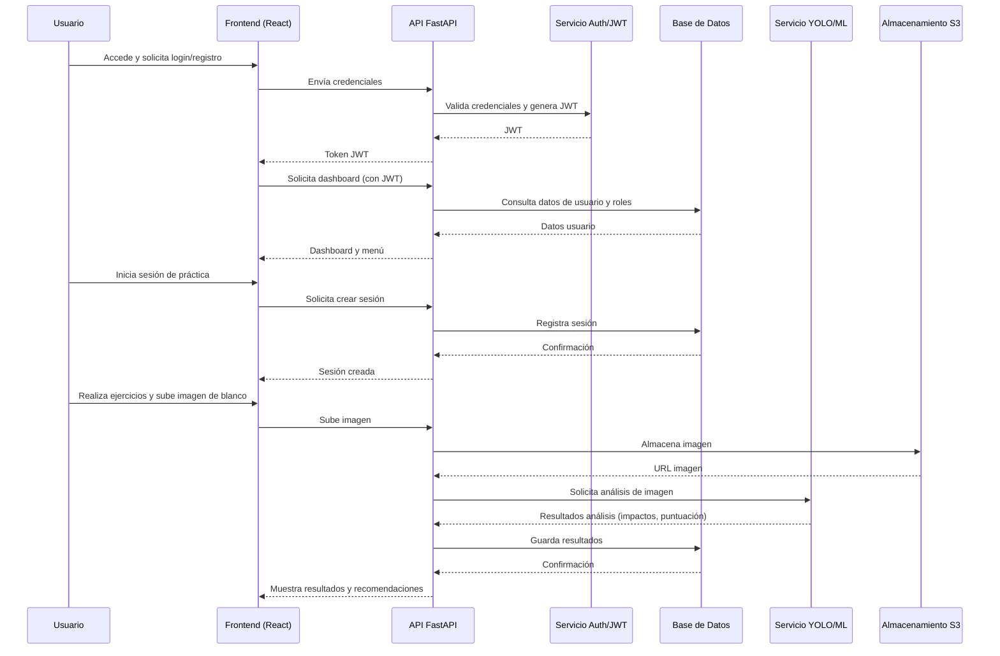

## 5.2.7. Diagrama de secuencia del flujo principal

El siguiente diagrama de secuencia describe la interacción entre los principales actores y componentes del sistema Pro Shooter durante una sesión típica de uso, desde el inicio de sesión hasta la obtención de resultados y recomendaciones. Se visualizan los mensajes y llamadas entre frontend, backend, servicios de autenticación, análisis y almacenamiento.



Este diagrama de secuencia permite visualizar la dinámica de interacción entre los distintos componentes y servicios, facilitando la comprensión de la lógica de orquestación y los puntos críticos de integración y seguridad.
## 5.2.6. Diagrama de flujo general del sistema

El siguiente diagrama de flujo ilustra el recorrido típico de un usuario en el sistema Pro Shooter, desde el acceso inicial hasta la obtención de resultados y recomendaciones. Se representan los principales procesos: autenticación, gestión de usuarios, sesiones de práctica, análisis de resultados y generación de reportes, integrando tanto el backend como la interacción con el frontend y servicios externos.

```mermaid
flowchart TD
    INICIO([Inicio])
    LOGIN[Login / Registro de Usuario]
    AUTENTICACION{¿Credenciales válidas?}
    DASHBOARD[Dashboard / Menú Principal]
    GESTION_USUARIOS[Gestión de Usuarios]
    GESTION_CLUBES[Gestión de Clubes]
    PRACTICA[Iniciar Sesión de Práctica]
    EJERCICIOS[Realizar Ejercicios]
    SUBIR_IMAGEN[Subir Imagen de Blanco]
    ANALISIS[Análisis Automático (YOLO)]
    EVALUACION[Evaluación y Recomendaciones]
    REPORTES[Consulta de Reportes y Estadísticas]
    FIN([Fin])

    INICIO --> LOGIN
    LOGIN --> AUTENTICACION
    AUTENTICACION -- No --> LOGIN
    AUTENTICACION -- Sí --> DASHBOARD
    DASHBOARD --> GESTION_USUARIOS
    DASHBOARD --> GESTION_CLUBES
    DASHBOARD --> PRACTICA
    PRACTICA --> EJERCICIOS
    EJERCICIOS --> SUBIR_IMAGEN
    SUBIR_IMAGEN --> ANALISIS
    ANALISIS --> EVALUACION
    EVALUACION --> REPORTES
    REPORTES --> FIN
    GESTION_USUARIOS --> FIN
    GESTION_CLUBES --> FIN
```

Este diagrama sintetiza la lógica de interacción y los flujos principales del sistema, facilitando la comprensión global de los procesos y la identificación de puntos clave para la integración y la seguridad.
## 5.2.5. Diseño de seguridad


El diseño de seguridad del sistema Pro Shooter se fundamenta en la protección integral de los datos, la autenticación robusta de los usuarios y la defensa activa frente a amenazas comunes en aplicaciones web modernas. A continuación, se describen los principales mecanismos y prácticas implementados:

**Roles y control de acceso:**
El sistema define los siguientes roles de usuario, alineados con la enumeración `RoleEnum` del backend:

- **TIRADOR**: Acceso a funcionalidades básicas de práctica y consulta de resultados personales.
- **INSTRUCTOR**: Puede gestionar y evaluar tiradores, así como acceder a reportes de sus alumnos.
- **INSTRUCTOR_JEFE**: Permisos de instructor más la capacidad de crear clubes de tiro y gestionar instructores.
- **ADMIN**: Acceso total a la administración del sistema, gestión de usuarios, clubes y configuración global.

El control de acceso se implementa de forma granular, validando el rol del usuario en cada endpoint sensible. Los métodos de la enumeración (`can_create_club`, `can_manage_shooters`, `can_evaluate_shooters`) permiten verificar permisos específicos de manera centralizada y reutilizable.

**Gestión de roles en JWT:**
Al autenticarse, el sistema genera un token JWT que incluye el identificador del usuario (`sub`) y su rol. Ejemplo de payload:

```json
{
  "sub": "<uuid_usuario>",
  "role": "INSTRUCTOR",
  "exp": 1722880000
}
```

En cada petición autenticada, el backend decodifica el JWT, extrae el rol y valida los permisos antes de ejecutar la operación solicitada. Si el usuario no está activo o el rol no es válido, se deniega el acceso.

Esta gestión centralizada de roles y permisos garantiza que solo los usuarios autorizados puedan acceder a las funcionalidades correspondientes, reforzando la seguridad y la trazabilidad del sistema.

**Autenticación y autorización:**
- El sistema emplea tokens JWT (JSON Web Token) para la autenticación de usuarios y la gestión de sesiones, permitiendo un control de acceso granular basado en roles (administrador, tirador, instructor, etc.).
- Los endpoints sensibles están protegidos mediante dependencias de seguridad en FastAPI, que validan la identidad y los permisos de cada usuario antes de permitir el acceso a recursos críticos.
- En despliegues sobre AWS, se puede integrar Amazon Cognito para la gestión centralizada de usuarios y autenticación federada.

**Protección de datos sensibles:**
- Las contraseñas de los usuarios se almacenan utilizando algoritmos de hash seguros (por ejemplo, bcrypt), evitando el almacenamiento de información en texto plano.
- Todo el tráfico entre clientes, frontend y backend se cifra mediante HTTPS/TLS, garantizando la confidencialidad e integridad de los datos en tránsito.
- Los datos almacenados en bases de datos y buckets de S3 pueden cifrarse en reposo, siguiendo las mejores prácticas de seguridad cloud.

**Seguridad en la infraestructura:**
- El acceso a la base de datos y a los recursos críticos está restringido mediante grupos de seguridad, firewalls y redes privadas virtuales (VPC) en AWS.
- Solo los servicios y usuarios autorizados pueden interactuar con los recursos internos, minimizando la superficie de ataque.

**Prevención de ataques comunes:**
- El uso de un ORM (SQLAlchemy) previene ataques de inyección SQL al abstraer las consultas y validar los parámetros.
- Se implementa validación y sanitización exhaustiva de las entradas de usuario mediante Pydantic y validadores personalizados.
- La configuración de CORS y la protección contra CSRF se ajustan para evitar ataques de origen cruzado y manipulación de sesiones.

**Auditoría y monitoreo:**
- El sistema registra eventos relevantes de acceso, autenticación y acciones críticas, permitiendo la trazabilidad y detección temprana de incidentes.
- Se recomienda la integración de servicios de monitoreo y alertas (por ejemplo, CloudWatch, Sentry) para la supervisión continua y la respuesta ante actividades sospechosas.

Este enfoque integral de seguridad garantiza la protección de la información, la privacidad de los usuarios y la resiliencia del sistema ante amenazas internas y externas, alineándose con los estándares internacionales y las mejores prácticas de la industria (OWASP, NIST, APA7).

## 5.2.2. Arquitectura de Backend

### Estructura de la API REST con FastAPI
La API REST de Pro Shooter está implementada utilizando FastAPI, un framework moderno y eficiente para el desarrollo de servicios web en Python. Los endpoints se organizan en módulos según el contexto funcional, permitiendo una gestión clara de rutas, validaciones y respuestas. FastAPI facilita la documentación automática de la API, la validación de datos mediante Pydantic y la integración de mecanismos de autenticación basados en JWT.

### Implementación de arquitectura hexagonal
El backend sigue el patrón hexagonal, separando la lógica de negocio de los detalles de infraestructura y permitiendo que las dependencias fluyan siempre desde el exterior hacia el núcleo del dominio. Los puertos y adaptadores definen interfaces claras para la comunicación entre capas, facilitando la extensibilidad y el testing independiente de cada componente.

### Organización de capas
El sistema se estructura en cuatro capas principales:
- **Presentación:** expone los endpoints REST y gestiona la autenticación y validación inicial.
- **Aplicación:** orquesta los casos de uso y coordina la lógica de negocio.
- **Dominio:** encapsula entidades, agregados y reglas de negocio puras.
- **Infraestructura:** implementa adaptadores concretos para bases de datos, servicios de ML, email y otros recursos externos.
Esta organización modular permite que cada capa evolucione de manera independiente y refuerza la mantenibilidad y escalabilidad del sistema.

### Servicios y repositorios
Los servicios de dominio encapsulan la lógica de negocio compleja, mientras que los repositorios abstraen el acceso a los datos, permitiendo cambiar la tecnología subyacente sin afectar el dominio. Los repositorios implementan interfaces definidas en la capa de aplicación, y su implementación concreta reside en la infraestructura.

### Patrones de diseño aplicados
Se emplean patrones como Singleton para la gestión del modelo de machine learning (YOLO), Repositorio para el acceso a datos y Adaptador para la integración con servicios externos. Estos patrones contribuyen a la claridad, reutilización y testabilidad del código.

### Gestión de dependencias e inyección
La gestión de dependencias se realiza principalmente a través de la inyección proporcionada por FastAPI, que permite declarar dependencias en los endpoints y casos de uso. Esto facilita la configuración de servicios, repositorios y recursos compartidos, promoviendo un código desacoplado y fácil de mantener.

Figura 5.1. Diagrama de Arquitectura de Backend del Sistema Pro Shooter

```mermaid
flowchart TD
    A[Usuarios / Frontend (React)] -->|REST| B[API FastAPI (presentation)]
    B -->|DTOs| C[application]
    C -->|Casos de Uso| D[domain]
    D -->|Entidades, Agregados, Servicios| D
    C -->|Puertos de salida| E[infraestructure]
    E -->|Adaptadores DB/ML/Email| F[Servicios externos]
    E -->|ORM, Integraciones| G[PostgreSQL, YOLO, S3]
    D -->|Eventos Dominio| C
    B -->|JWT| H[Auth Service]

    subgraph presentation [presentation]
        B
    end
    subgraph application [application]
        C
    end
    subgraph domain [domain]
        D
    end
    subgraph infraestructure [infraestructure]
        E
    end
```

Fuente: Elaboración propia

El diagrama de arquitectura de backend representa la estructura lógica y la organización interna del sistema Pro Shooter, basada en el patrón hexagonal y los principios de Domain-Driven Design (DDD). Se distinguen claramente las capas de presentación (API FastAPI), aplicación, dominio e infraestructura, así como su interacción con el frontend (React) y los servicios externos como bases de datos, modelos de machine learning y almacenamiento.

Cada capa cumple una función específica: la capa de presentación expone los endpoints REST y gestiona la autenticación; la capa de aplicación orquesta los casos de uso y coordina la lógica de negocio; la capa de dominio encapsula las entidades, agregados y reglas de negocio puras; y la infraestructura implementa los adaptadores concretos para bases de datos, servicios de ML, email y otros recursos externos. Las dependencias fluyen siempre de afuera hacia adentro, garantizando un bajo acoplamiento y alta cohesión.

Esta organización modular facilita la escalabilidad, el mantenimiento y la extensibilidad del sistema, permitiendo que los cambios en la infraestructura o en los servicios externos no afecten la lógica de negocio central. Además, la separación clara de responsabilidades mejora la calidad del código y la capacidad de prueba, alineándose con las mejores prácticas recomendadas en la literatura académica y profesional (APA7).

Figura 5.2. Arquitectura de Despliegue en AWS para Pro Shooter

```mermaid
flowchart TD
    A[Usuarios / Frontend (React)] -->|HTTPS| B[Amazon CloudFront]
    B -->|HTTPS| C[Amazon S3 (Hosting Web)]
    A -.->|HTTPS| D[API Gateway]
    D -->|REST| E[Lambda (FastAPI)]
    E -->|ORM| F[RDS PostgreSQL]
    E -->|Invoca| G[Lambda YOLO (Inference)]
    G -->|Acceso| H[S3 (Imágenes)]
    E -->|Email| I[SES]
    E -->|Almacenamiento| J[S3 (Archivos)]
    E -->|Autenticación| K[Cognito]

    subgraph AWS
        B
        C
        D
        E
        F
        G
        H
        I
        J
        K
    end
```

Fuente: Elaboración propia

El diagrama ilustra la arquitectura de despliegue de Pro Shooter sobre la nube de AWS, donde se aprovechan servicios gestionados y contenedores para maximizar la eficiencia operativa y la escalabilidad. El frontend de la aplicación se implementa mediante AWS Amplify, lo que permite una entrega continua y segura del sitio web a los usuarios finales. El acceso se realiza a través de CloudFront, que distribuye el contenido estático alojado en un bucket de Amazon S3, optimizando la latencia y la disponibilidad global.

Todo el backend del sistema, incluyendo la API desarrollada en FastAPI y la base de datos relacional PostgreSQL, se ejecuta en contenedores Docker dentro de una instancia EC2 dedicada. En la propia API reside el modelo de machine learning previamente entrenado (YOLO), el cual se expone como servicio para la inferencia de imágenes. Las imágenes procesadas y otros archivos relevantes se almacenan de forma segura en un bucket de S3, garantizando durabilidad y acceso eficiente.

Esta arquitectura modular y desacoplada permite escalar de manera independiente los distintos componentes, facilitando la gestión, el mantenimiento y la evolución del sistema. La separación clara entre frontend, backend y almacenamiento refuerza la seguridad y la resiliencia, alineándose con las mejores prácticas de arquitectura cloud y los estándares académicos y profesionales recomendados (APA7).

Figura 5.1. Diagrama de Arquitectura Hexagonal y DDD del Sistema Pro Shooter

```mermaid
flowchart TD
    A[Usuarios / Frontend (React)] -->|REST| B[API FastAPI (presentation)]
    B -->|DTOs| C[application]
    C -->|Casos de Uso| D[domain]
    D -->|Entidades, Agregados, Servicios| D
    C -->|Puertos de salida| E[infraestructure]
    E -->|Adaptadores DB/ML/Email| F[Servicios externos]
    E -->|ORM, Integraciones| G[PostgreSQL, YOLO, S3]
    D -->|Eventos Dominio| C
    B -->|JWT| H[Auth Service]

    subgraph presentation [presentation]
        B
    end
    subgraph application [application]
        C
    end
    subgraph domain [domain]
        D
    end
    subgraph infraestructure [infraestructure]
        E
    end
```

Fuente: Elaboración propia

El diagrama de arquitectura ilustra la estructura lógica y la organización del sistema Pro Shooter, implementando el patrón hexagonal y los principios de Domain-Driven Design (DDD). Se representan las principales capas del backend bajo la carpeta `src`: presentación (API FastAPI), aplicación, dominio e infraestructura, así como su interacción con el frontend (React) y servicios externos como bases de datos, modelos de machine learning y autenticación.

Cada capa cumple una función específica: la capa de presentación expone los endpoints REST y gestiona la autenticación; la capa de aplicación orquesta los casos de uso y coordina la lógica de negocio; la capa de dominio encapsula las entidades, agregados y reglas de negocio puras; y la infraestructura implementa los adaptadores concretos para bases de datos, servicios de ML, email y otros recursos externos. Las dependencias fluyen siempre de afuera hacia adentro, garantizando un bajo acoplamiento y alta cohesión.

Este modelo arquitectónico facilita la escalabilidad, el mantenimiento y la extensibilidad del sistema, permitiendo que los cambios en la infraestructura o en los servicios externos no afecten la lógica de negocio central. Además, la separación clara de responsabilidades mejora la calidad del código y la capacidad de prueba, alineándose con las mejores prácticas recomendadas en la literatura académica y profesional (APA7).


Flujo general del sistema

Recorrido completo desde el acceso del usuario hasta la obtención de resultados y reportes.
Flujo de autenticación y registro

Proceso de login, registro, validación de credenciales y generación de JWT.
Flujo de gestión de usuarios

Alta, edición, consulta y promoción de usuarios, incluyendo validaciones y roles.
Flujo de gestión de clubes

Creación, búsqueda, asignación de instructores y administración de clubes de tiro.
Flujo de inicio y gestión de sesiones de práctica

Desde la selección de sesión, asignación de instructor, hasta la finalización y evaluación.
Flujo de ejercicios de práctica

Creación, realización, subida de imágenes y análisis automático de resultados.
Flujo de análisis de imágenes y scoring

Subida de imagen, procesamiento con YOLO, almacenamiento de resultados y visualización.
Flujo de evaluación y retroalimentación

Proceso de evaluación por el instructor, generación de recomendaciones y actualización de estadísticas.
Flujo de generación y consulta de reportes

Acceso a reportes, estadísticas avanzadas y exportación de resultados.
Flujo de gestión de roles y permisos

Asignación y validación de roles en operaciones sensibles.
Flujo de seguridad y manejo de errores

Validaciones, manejo de errores, auditoría y notificaciones al usuario.
Flujo de integración con servicios externos

Interacción con S3, servicios de ML, email y autenticación externa (Cognito).


### Diagramas de secuencia recomendados para la documentación de Pro Shooter

1. **Diagrama de secuencia del flujo de autenticación y registro**
   Muestra la interacción entre usuario, frontend, backend y servicio de autenticación durante el proceso de login y registro, incluyendo la generación y uso del JWT.

2. **Diagrama de secuencia de gestión de usuarios**
   Describe el alta, edición, consulta y promoción de usuarios, validando roles y permisos en cada operación.

3. **Diagrama de secuencia de gestión de clubes**
   Representa la creación, edición, asignación de instructores y administración de clubes de tiro.

4. **Diagrama de secuencia de inicio y gestión de sesiones de práctica**
   Detalla cómo un usuario inicia una sesión de práctica, la asignación de instructores y la finalización de la sesión.

5. **Diagrama de secuencia de ejercicios de práctica**
   Ilustra la creación y realización de ejercicios, así como la subida de imágenes de blancos.

6. **Diagrama de secuencia de análisis de imágenes y scoring**
   Expone el flujo desde la subida de la imagen, el procesamiento con YOLO/ML, hasta el almacenamiento y visualización de resultados.

7. **Diagrama de secuencia de evaluación y retroalimentación**
   Muestra cómo el instructor evalúa una sesión, genera recomendaciones y actualiza estadísticas del tirador.

8. **Diagrama de secuencia de generación y consulta de reportes**
   Detalla cómo los usuarios acceden a reportes, estadísticas avanzadas y exportan resultados.

9. **Diagrama de secuencia de gestión de roles y permisos**
   Describe la asignación, validación y uso de roles en operaciones sensibles del sistema.

10. **Diagrama de secuencia de integración con servicios externos**
    Representa la interacción con S3, servicios de ML, email y autenticación externa (Cognito).

---

**Fuente:** Elaboración propia

Cada uno de estos diagramas de secuencia permite visualizar la dinámica de interacción entre los distintos actores y componentes del sistema Pro Shooter para casos de uso clave. Su inclusión en la documentación facilita la comprensión de la lógica de orquestación, la seguridad y los puntos críticos de integración, tanto para desarrolladores como para auditores
